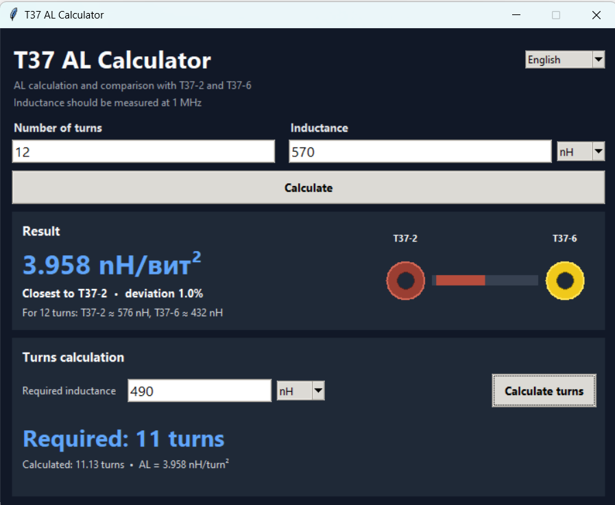

# T37 AL Calculator

A small Python GUI utility for calculating the **AL value of toroidal cores** and comparing the result with **T37-2** and **T37-6** cores.

The program can also calculate the required number of turns for a target inductance using the measured AL value.

## Features

- Calculate AL from:
  - number of turns
  - measured inductance
- Compare the calculated AL with:
  - T37-2
  - T37-6
- Graphical indication showing which core the result is closer to
- Calculate the required number of turns for a desired inductance
- Automatic rounding to the nearest whole number of turns
- Inductance input in:
  - nH
  - µH

## Important

For reliable comparison of the AL value, the inductance should be measured at:

**1 MHz** or **100 kHz**

The turns should be distributed evenly around the toroidal core.

## Formula

AL is calculated as:

\[
A_L = \frac{L}{N^2}
\]

where:

- `AL` — inductance factor in nH/turn²
- `L` — measured inductance in nH
- `N` — number of turns

The number of turns for a required inductance is calculated as:

\[
N = \sqrt{\frac{L}{A_L}}
\]

The result is rounded to the nearest whole turn.

## Reference values

| Core | AL |
|---|---:|
| T37-2 | 4.0 nH/turn² |
| T37-6 | 3.0 nH/turn² |

## Example

For:

- 12 turns
- 570 nH measured inductance

the calculated AL is:

\[
A_L = \frac{570}{12^2} \approx 3.96 \text{ nH/turn}^2
\]

which is much closer to **T37-2**.

## Requirements

- Python 3
- Tkinter

Tkinter is included with the standard Python installation on Windows.

## Run from source

```bash
python T37_AL_Calculator.py
```

## Windows executable

A ready-to-use Windows `.exe` version is available in the **Releases** section.

The executable was built from the Python source using **PyInstaller**, so Python does not need to be installed separately.

Download the latest release and run:

```text
T37_AL_Calculator.exe
```

## Screenshot

```markdown

```

## License

You can add the license of your choice, for example MIT.
